# ProgrammableWeb中Mashup-API数据统计与分析

ProgrammableWeb是一个较为权威的API信息网站，除了提供API相关的最新资讯外，其同时提供了详实的API、Mashup目录供开发者搜索与了解。我们以Liu等人在Github上开源的[ProgrammableWeb数据集](https://github.com/HIT-ICES/Correted-ProgrammableWeb-dataset)为基础，对其中Mashup-API相关的数据进行了统计与分析。

根据大作业要求，我们的统计与分析包括：

1. 基本统计信息：Mashup包括的API个数、API被Mashup调用的次数、Web API提供商发布的API个数
2. 需求关键词下的Mashup-API间的关系：Mashup与API间的调用需求关系
3. 非功能视角下的API间关系分析：API间的共同调用次数

用于对数据进行分析统计的代码可见：[Gitee](https://gitee.com/VanHelsingFang/Python_Project)、[Github](https://github.com/HaoxuFang/Python_Project)

代码计算得到的具体统计信息都可在对应的`.xlsx`文件中进行查看，在报告中只会对整体的数据情况进行分析。

## 基本统计信息

### Mashup包括的API个数

在数据集的`m-a_edges.csv`文件中，记录了Mashup与API之间的调用关系，其每行数据表明了一个Mashup调用一个API的记录，将数据按照Mashup名称与API名称分别聚合后，可以得到每个Mashup调用的所有API与每个API被所有对应的Mashup的调用记录。具体实现上使用字典存储了Mashup与API间的映射关系，之后将字典转换为`pandas`中的`DataFrame`结构便于进行数据分析与导出，导出的数据被分别存储在`Mashup_to_API.xlsx`与`API_to_Mashup.xlsx`文件中。

我们可以先利用`pandas`提供的`describe()`函数来查看每个Mashup平均下来调用API的个数：

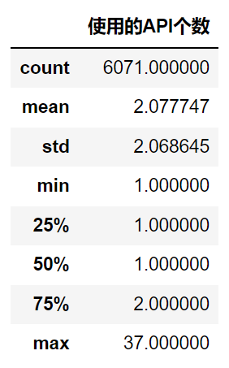

可以看到`m-a_edges.csv`中一共记录了6071个Mashup的API调用信息，其中绝大部分Mashup都只调用了1个API，这种Mashup可以理解为对特定的API进行了一层封装以实现想要达到的应用效果。我们可以取其中一个具体的Mashup信息来帮助我们理解，如`Mashup: CouponRoots`，其只调用了一个API`/api/coupon`。在数据集中的`raw/api_mushup/active_mashups_data.txt`和`raw/api_mushup/active_apis_data.txt`这两个文件中可以找到对于Mashup和API的具体描述。根据文件的描述，该Mashup的功能是能够让用户检索折扣与优惠券，而该API的功能是从联盟营销项目中返回优惠券信息，由此可以推测Mashup在API的基础上封装了一层查询功能使得用户可以有选择性地获取和使用折扣与优惠券。

类似地，利用`sort_values()`函数我们可以按照Mashup使用的API个数进行排序，获取得到的使用API个数最多的前10个Mashup为：

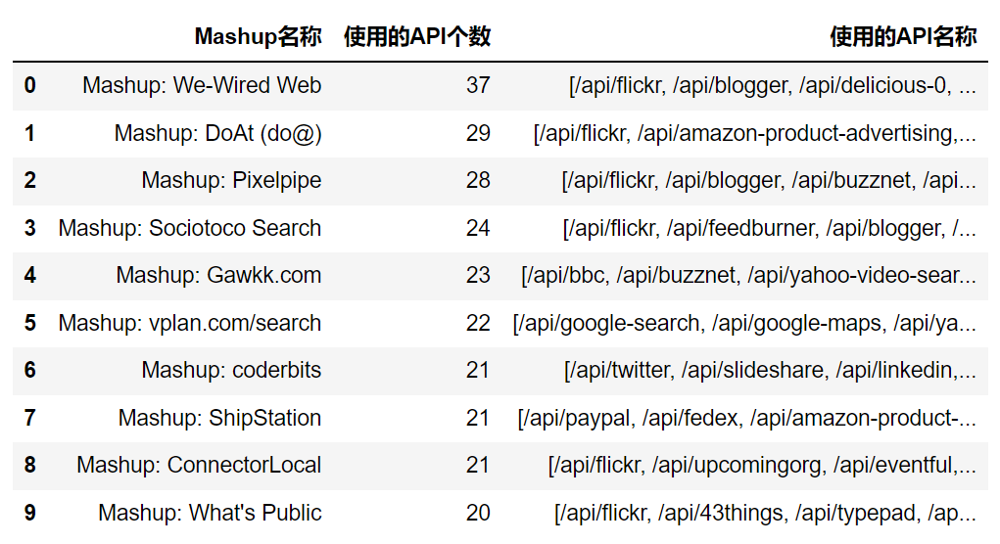

以`We-Wired Web`为例，其描述为一种集成好的、可扩展的Web APP，所谓“集成”想必是通过调用多个不同API提供的功能来实现自身的多功能集成性，这也就解释了为什么它会调用多达37个API。

### API被Mashup调用的次数

同样地，我们也能够获取每个API平均被Mashup使用的次数：

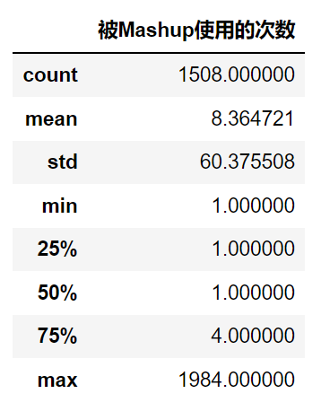

可以看到`m-a_edges.csv`中一共记录了1508个不同的API，大部分的API也都是只被调用了一次，这可能和我们在前文分析Mashup的情况类似：即特定API给出了一种粒度较小的操作，而更完善的应用可以通过Mashup再进一步封装，而较小粒度的操作也提高了API调用的便捷性，方便日后供更多Mashup和其他应用进行调用。

不过值得注意的是，API平均被调用次数的标准差非常大，被调用最多的API被高达1984个Mashup调用过，我们同样利用`sort_values()`来查看一下被调用次数最高的10个API：

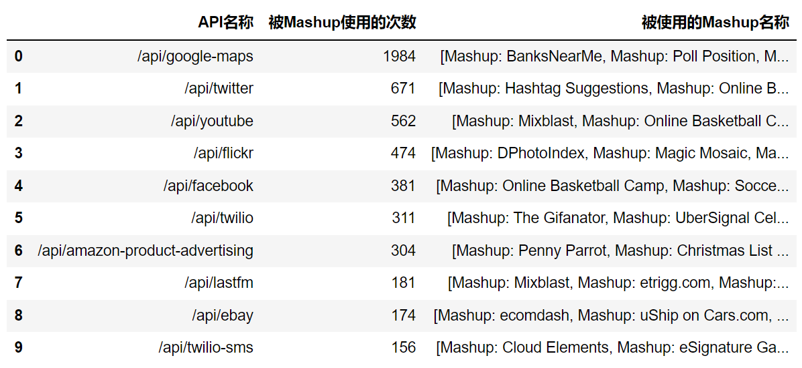

可以看到被最多Mashup所使用的API是`google-maps`，这也可以理解，除了最直接的地图、导航等应用，社交媒体、点评网站、购物网站都有获取位置信息的需求，只需要调用`google-maps`这一API即可实现。而其他被调用次数较高的API其对应的功能也都在我们的日常生活中非常常见，比如视频网站（`youtube`），购物网站（`ebay`），社交媒体（`twitter`、`facebook`），广告推送（`amazon-product-advertising`）等。

### Web API提供商发布的API个数

在数据集的`/raw/accessibility/api_accessibility`文件夹中可以找到多个`.txt`文件，其以`JSON`的格式记录了ProgrammableWeb中给出的API在目前的可访问性。不过我们目前只关注这些文件中给出的API对应的Web URL，在一个API对应的数据中存在多个Web URL，我们首选`API Endpoint`作为该API对应的Web URL，不过部分API数据中没有`API Endpoint`的信息，此时我们则以`API Portal / Home Page`作为Web URL。我们以API对应的Web URL的一级域名作为该API的提供商，以此来统计不同提供商发布的API个数。

不过在Web URL中提取一级域名并非易事，在观察数据后发现Web URL之间存在着较大的差异：一是存在不同的顶级域名，如`.com`、`.net`等；二是有二级域的存在，比如`.com.cn`；三是不同国家和地区的Web URL有较为明显的地域特征，如数据集中很多来自英国的Web URL的二级域为`.co.uk`。如此，我们很难通过正则表达式来提取一域名，最后采用了将Web URL先按`/`分组来获取域名部分，再按`.`分组并提取最后两组内容组成一级域名这样“曲线救国”的方法。不过这种方法仍然会在面对上面提到的第二和第三点差异时出现问题，可以通过判断提取出来的一级域名算不算是二级域来进一步提取更靠前的域名信息，不过这种方法只能依靠判断顶级域名是否不在域名的末尾来判断。在最终的提取过程中，我们尽可能地枚举了大部分顶级域名以保证大多数一级域名提取的正确性。

同样地，在提取域名后，我们通过聚合域名以得到每个域名所提供API。值得注意的一点是，在`api_accessibility`的数据文件中除了`m-a_edges.csv`中出现过的API以外还有其他之前未被记录的API。我们最终将数据文件中的全部API信息以及之前出现过的API信息分别进行了统计，并将结果分别写入进了`Web_Published_API.xlsx`和`Web_Published_API_Mashup.xlsx`。

我们先来看数据中的全部API信息，可以看到每个提供商平均发布的API个数：

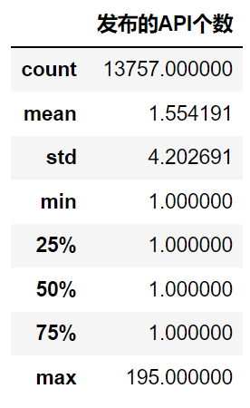

可以看到一共统计到了13757个Web URL作为API提供商，不过大部分提供商都只发布了1个API，只有小部分提供商发布了多个，最多的提供商发布了195个。

利用`sort_values()`我们可以查看是哪些提供商发布了较多的API：

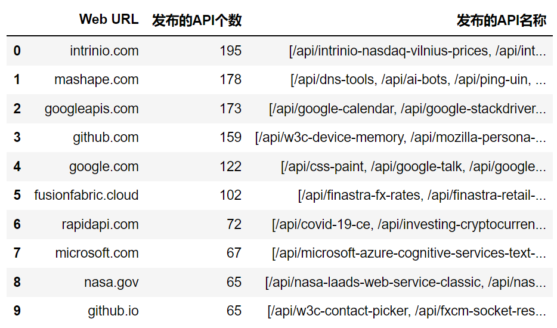

其中发布195个API的`intrinio.com`是统计和发布实时金融数据的网站，前十名中也不乏我们较为熟知的网站，如`google.com`、`github.com`、`microsoft.com`等。值得注意的一点是，像Google和Github都存在同一个网站存在多个一级域名不同的提供API的网站，如直接写明是用于发布API的`googleapis.com`，以及专门用于个人及项目网页制作的`github.io`都与原本的主站一级域名不同。

接着我们考虑之前在Mashup中出现过的API的信息，平均每个提供商发布的API个数：

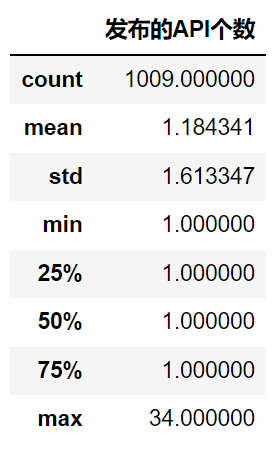

可以看到一共只统计到了1009个提供商发布的API被之前统计的Mashup所使用，并且大部分提供商也都只发布了1个API，只有小部分提供商发布了多个，最多的提供商发布了34个。

利用`sort_values()`查看具体发布了最多被Mashup所使用的API的前十名提供商可以看到：

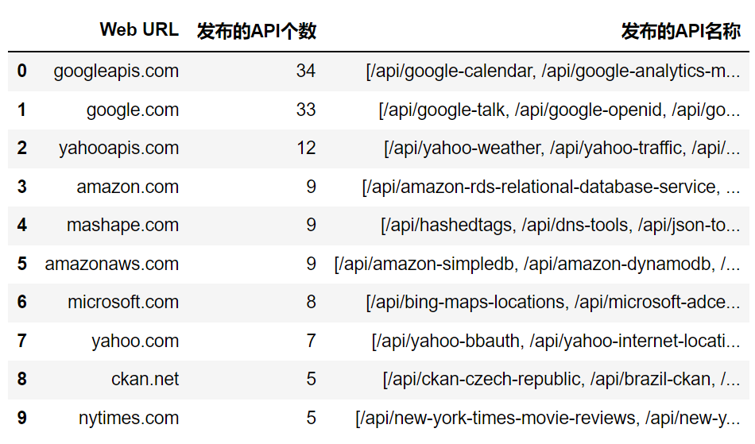

可以看到Google发布的有被使用的API数量一骑绝尘，`googleapis.com`和`google.com`发布的API数分列一二名，并且像Yahoo和Amazon也都有多个一级域名发布API的情况，如写明是提供API的`yahooapis.com`和专门负责云计算相关业务的`amazonaws.com`。

## 需求关键词下的Mashup-API间的关系

在`raw/api_mushup/active_mashups_data.txt`文件中记录了每个Mashup对应的类别（Category）及其调用的API信息，并且API信息中包括其功能标注（Tag）的数据，可以让我们从需求关键词的视角下分析Mashup与API间的关系。

> `raw/api_mushup/deadpool_mashups_data.txt`记录了已不再提供服务的Mashup的信息，本着互联网更新迭代快，信息都有时效性的原则，我们将只对`active_mashups_data.txt`中记录的仍然提供服务的Mashup进行分析。

我们首先考虑建立起Mashup-类别-调用的API-API对应的功能标注集合的完整联系。数据文件中以`JSON`的格式记录了相应的信息，遍历时存储我们想要的信息即可。注意原数据中存在对同一Mashup有重复的相同类别以及对同一API有重复的功能标注的情况，在存储时需要注意去重。最终我们将处理后的结果存入`Mashup_API_Category_Tag.xlsx`文件中。

> 原始数据中存在部分Mashup类别为空或API功能标签为空的数据，因为占比较小，我们对这部分数据也予以了保留。

观察得到的处理后的数据文件，最为直观的是我们能看到很多类别完全一致的Mashup，但他们调用的API以及API对应的功能标签不相同。这里我们以类别同为旅游的两个Mashup为例：

|   Mashup名称   | 对应类别 |                         调用API名称                         |                         API功能标签                          |
| :------------: | :------: | :---------------------------------------------------------: | :----------------------------------------------------------: |
| Trip  Republic |  Travel  | viator, **bookingcom-content**, **skyscanner-live-pricing** | Travel, Recreation, Referrals, Hotels, Booking, Prices, B2B, Tourism, Air Travel, Search, Comparisons, Transportation, Rentals |
|   Holidayen    |  Travel  |             **flickr**, **google-maps**, viator             | Video, Photos, Viewer, Mapping, Recreation, Travel, Referrals |

有意思的是，在`active_mashups_data.txt`文件中，可以看到这两个Mashup的具体功能都是规划外出旅游路线，但它们调用的API却呈现出了很大的区别。首先两个Mashup都调用了`viator`，该API提供了预定酒店、机票以及旅行团的功能，这与Mashup的旅游类别相吻合。不同的是，`Trip Republic`还调用了`bookingcom-content`和`skyscanner-live-pricing`，前者可以返回Booking上的酒店评价信息，后者则可以返回机票的实时票价，由此可见该Mashup更侧重于酒店机票的预定功能以帮助用户规划旅游行程；而`Holidayen`则调用了`flickr`和`google-maps`，前者提供了照片上传和查看的服务，后者则提供了地图信息，可以猜想到该Mashup更侧重于利用旅游目的地的实地照片以及当地旅行的路线规划来为用户提供咨询，并且也允许用户直接通过该Mashup进行订机票订酒店等操作。

在统计数据的过程中，我们顺便对每一种Mashup类别以及API的功能标签进行了计数，根据统计结果，数量前五的Mashup类别为：

| Mashup类别 | 数量 |
| :--------: | :--: |
|  Mapping   | 2285 |
|   Search   | 964  |
|   Social   | 944  |
| eCommerce  | 658  |
|   Photos   | 656  |

可以看到排名前五的类别基本上涵盖了目前我们在互联网上的主要应用场景，并且提供地图相关功能的Mashup数量显著高于其他类别，这实质上可以归功于有大量API提供了地图相关的功能，使得Mashup可以通过调用来实现自己想要的部分功能，考虑到目前的互联网应用几乎都需要地图相关的功能：社交媒体需要定位、在线购物需要查看物流信息、点评网站需要查看店家地址、锻炼软件可以记录自己的跑步路线、相机需要记录拍摄地点，更不必说还有导航软件。对于需要地图相关功能的应用，开发团队不可能都自己从零建立起一个地图系统，因为地图相关的功能显然不会是它们产品的核心功能。如此便显现出了API生态的优势，提供商通过开放自己设计完备的某些系统的接口，从而能够对外提供部分的功能，其他开发者便可以节省开发对应功能的时间以专注于核心功能的实现。

以此，我们实际上可以看到数量前五的API功能标签与Mashup类别是比较一致的：

| API功能标签 | 数量 |
| :---------: | :--: |
|   Mapping   | 3334 |
|   Viewer    | 2393 |
|   Social    | 2236 |
|   Search    | 1411 |
|    Video    | 1297 |

接着，我们进一步细化了统计的粒度，建立起了Mashup类别-API功能标签的直接对应关系：如果一个Mashup调用了某个API，那么该Mashup的类别将于该API的功能标签有1次联系关系，最后会以Mashup的类别为单位进行聚合，得到每个Masup类别与所有API功能标签的关联次数。最终的结果存储在`Category_Tag.xlsx`文件中。

我们可以以此列举数量前十的Mashup类别分别与API的功能标签的关联次数（取前五名）：

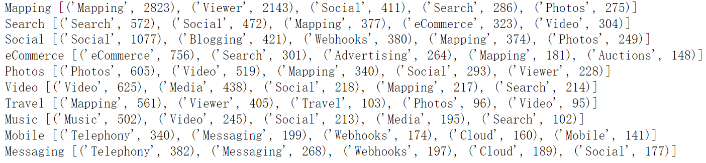

基本上每个Mashup类别实际上都有完全一致的API功能标签，但同时我们也可以从中解读一些常见的应用功能搭配：

- 比如对于线上购物（eCommerce），广告（Advertising）就是比较常见的搭配功能，其可以用于商品推荐，也可以专门用于厂家投放广告
- 对大部分类别，搜索（Search）与社交（Social）都是可以考虑加入的功能
- 部分类别可以考虑云（Cloud）上的功能，如云存储、云计算等
- 如有需要可以考虑加入Webhooks以实现消息的自动推送等

## 非功能视角下的API间关系分析

在本小节我们将重新对`m-a_edges.csv`中的数据进行审视，考虑所有调用了超过1个API的Mashup，在其调用的所有API中，我们记录每个API对的出现次数（API1-API2），为避免重复计数，我们令字典序靠前的API永远处在API1的位置。API对出现的次数越多，说明这两个API的兼容性更好，并且从功能上来说更加相辅相成。

同时，我们也将记录每个API对应的功能标签与API的类型来帮助我们分析API对次数多少是否存在某种规律。

> 部分API存在多种类型，具体表现为在数据中分别记录了其不同类型的子API（如Twitter就有`FEED`和`REST`两种类型的子API），但是`m-a_edges.csv`中并没有明确指出Mashup调用的具体是哪种类型的子API，我们最终将所有子API的类型都看作是该API的类型。

最终，我们将每对API的共同调用次数、功能标签是否存在重合以及API类型是否相同这些数据统一写入到`API_Pair.xlsx`文件中。

我们可以先利用`sort_values()`函数查看共同调用次数前十的API对：

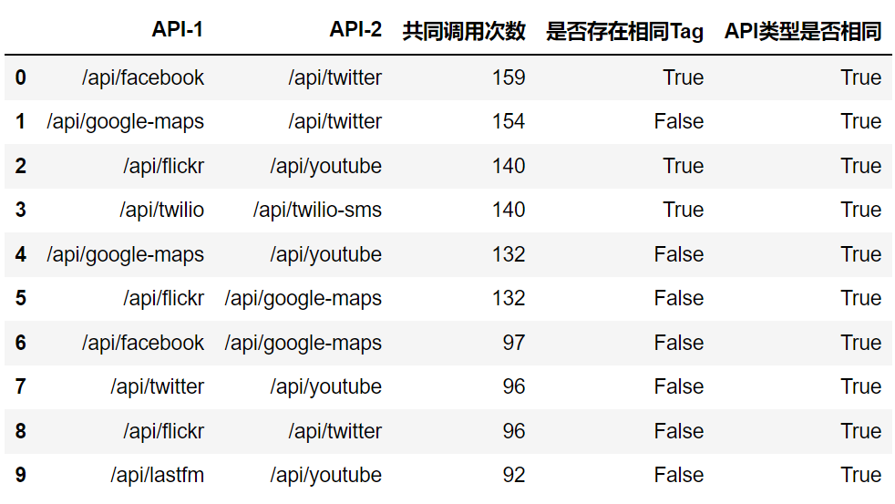

可以看到共同调用次数最多的是Facebook和Twitter的API，这也比较好理解，就像现在有很多软件都有设计分享功能，比如我们常见的分享到微信/微博/QQ等，类比到国外就是分享到Facebook/Twitter，所以这两个API回经常被同一个Mashup调用。另外还有像Google Map的API也与其他API共同调用频繁，猜测其基本都是扮演了获取位置信息的角色。当然还有像LastFM和Youtube这两个音频与视频网站之间的API互相调用也是较为常见的，比如可以歌曲的MV需要到视频网站看，而音源则需要到音乐网站获取，如此建立联系。

在观察这些API对是否存在相同Tag时，很容易发现他们是否存在相同Tag似乎对共同调用次数的多少没有明显的影响。从开发者的角度来看，如果Mashup需要实现某一特定功能，那么只需要调用具有相应功能的API即可，没有必要调用多个功能相同的API，除非有像前面提到过的要接入多个社交媒体实现分享功能这样的情况出现。

基于这种分析，我们可以预测到API间的共同调用次数应该与是否存在相同Tag是无关的。

从实际数据上来看，我们首先可以通过`describe()`函数来查看共同调用次数的分布情况：

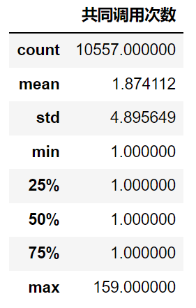

可以看到对于大部分API对也都是只共同调用了1次，只有小部分API对存在多次共同调用记录。平均下来每个API对之间也只是共调用了1.87次。

接着我们便可以通过对API对是否存在相同Tag进行`groupby()`来看存在和不存在相同Tag的API对各自的共同调用次数：

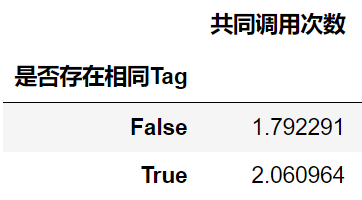

可以看到存在相同Tag的API对共同调用次数比总体平均值略高一点，但远没有达到可以说明其存在关联的程度。实际上，我们可以用`corr()`来计算两组数据间的相关性，考虑到是否存在相同Tag实际上是一组0-1值，可以看作是分类变量，我们采用`kendall`相关系数来进行计算，只需指明`corr(method="kendall")`即可，得到的结果为$0.059$。一般来说，相关性系数低于$0.2$就可被看作极弱相关或者不相关，所以我们可以认为API间的共同调用次数与API的Tag无关。

而对于API类型，虽然目前展示的前十组API对类型都是相同的，但纵观总体数据可以发现绝大部分API对的类型都是相同的，这与[开发时不建议混用不同类型的API](https://qa.1r1g.com/sf/ask/1562572791/)可能有关。总之观察数据时并不能发现较为明显的关联性。

我们可以对API的类型是否相同进行进行同样的计算：

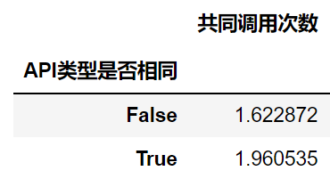

数据上来说同样不太能说明关联性，计算相关系数的结果为$0.0013$，显然也可以给出它们不存在关联的结论。

总结来说，非功能视角下API间不存在明显的关联。这或许与API生态有关：个人认为API本质上就是功能驱动的，Mashup需要某个功能就会去调用特定功能的API。